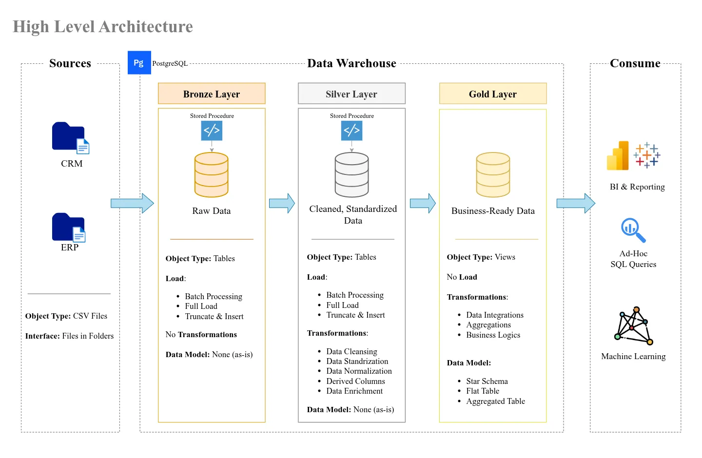
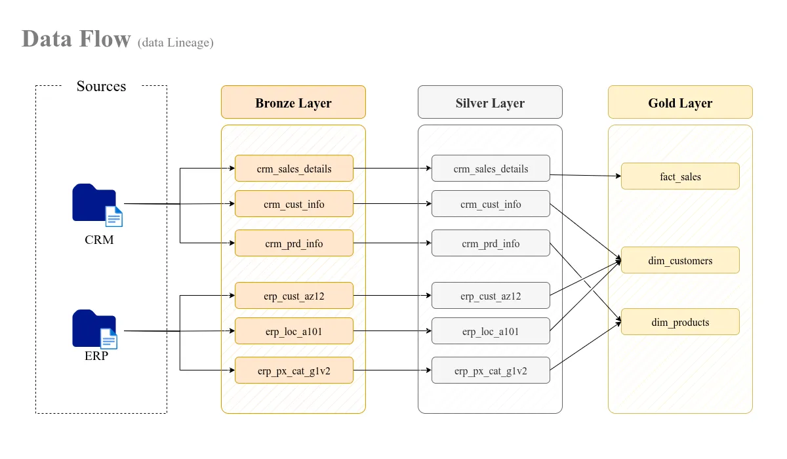

<!-- GitHub adds lines after h1 and h2. To get rid of them, I use 
 construction -->
<!-- Project name image -->

    

<!-- Some neat badges -->

    &#8287;
    &#8287;
    &#8287;
    &#8287;
    &#8287;
    &#8287;

<!-- Overview -->

    
<h2>Overview ✨</h2>

    This repository contains a <b>dbt + PostgreSQL based data warehouse</b> built and adapted from a 
    <a href="https://ua.udemy.com/course/building-a-modern-data-warehouse-data-engineering-bootcamp" target="_blank">Data Engineering Bootcamp</a> curriculum.   
    The original course examples use SQL Server — here, I re-implement them using dbt and PostgreSQL to deepen my understanding of SQL and warehouse design.

<!-- Objectives -->

    
<h2>Objectives 🎯</h2>

- Practice **SQL (DDL, DML, DCL, TCL)** in a warehouse environment
- Gain experience with **schema design and data modeling**
- Explore **ETL workflows** for loading and transforming data
- Learn **dimensional modeling** concepts
- Apply basic **analytics & reporting** queries
- Document progress as a learning and portfolio project

<!-- Data Architecture -->

    
<h2>Data Architecture 🏗</h2>

    This project follows the suggested Medallion Architecture (Bronze, Silver, Gold layers), a common pattern for modern data warehouses.
    

<!-- Data Flow -->

<h2>Data Flow 📽</h2>

    

<!-- Repository Structure -->

<h2>Repository Structure 📂</h2>

- `datasets` - Raw ERP and CRM datasets used for the project
- `docs` - Documentation and architecture diagrams
- `scripts` - SQL, Python, and Bash scripts for ETL and transformations
- `tests` - Validation scripts and data quality checks

<!-- Tech Stack -->

<h2>Tech Stack 🛠️</h2>

- **PostgreSQL**
- Bash / Python (for ETL & automation)

<!-- Status -->

<h2>Status 📈</h2>

Work in progress 🚧 — updated as I progress through the bootcamp.  
This is not a production-ready warehouse, but a **learning project** to practice data engineering fundamentals.

- [x] Add script for database initialization
- [x] Implement bronze level

<!-- Contributing -->

<h2>Contributing 🤝</h2>

This is a learner’s portfolio project, so external contributions are not expected. However, feedback and suggestions are always welcome 😎

<!-- Contact -->

<h2>Contact 🌐</h2>

You could find relevant contact info on my [GitHub profile](https://github.com/Todmount)

