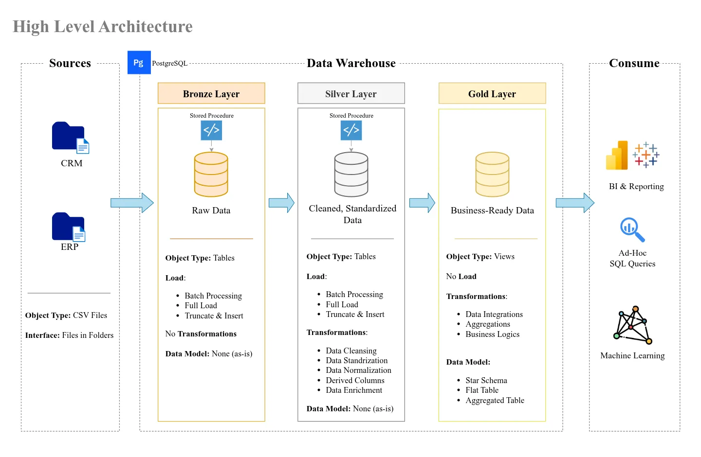

<!-- GitHub adds lines after h1 and h2. To get rid of them, I use 
 construction -->
<!-- There will be project_name.png in my style -->
# Data Engineering Warehouse

<!-- There will be some neat badges -->

This repository contains a **PostgreSQL-based data warehouse** built and adapted from a [Data Engineering Bootcamp](https://ua.udemy.com/course/building-a-modern-data-warehouse-data-engineering-bootcamp) curriculum.  
The original course examples use MySQL — here, I re-implement them in PostgreSQL to deepen my understanding of SQL and warehouse design.

<h2>Objectives 🎯</h2>

- Practice **SQL (DDL, DML, DCL, TCL)** in a warehouse environment  
- Gain experience with **schema design and data modeling**  
- Explore **ETL workflows** for loading and transforming data  
- Learn **dimensional modeling** concepts (Medallion schema)  
- Apply basic **analytics & reporting** queries  
- Document progress as a learning and portfolio project  

<h2>Data Architecture 🏗</h2>

This project follows the suggested Medallion Architecture (Bronze, Silver, Gold layers), a common pattern for modern data warehouses.

<h2>Repository Structure 📂</h2>

- `datasets` - Raw ERP and CRM datasets used for the project
- `docs` - Documentation and architecture diagrams
- `scripts` - SQL, Python, and Bash scripts for ETL and transformations
- `tests` - Validation scripts and data quality checks

<h2>Tech Stack 🛠️</h2>

- **PostgreSQL**  
- Bash / Python (for ETL & automation)  

<h2>Status 📈</h2>

Work in progress 🚧 — updated as I progress through the bootcamp.  
This is not a production-ready warehouse, but a **learning project** to practice data engineering fundamentals.   
- [x] Add script for database initialization

<h2>Contributing 🤝</h2>

This is a learner’s portfolio project, so external contributions are not expected. However, feedback and suggestions are always welcome.

<h2>Contact 🌐</h2>

You could find relevant contact info on my [GitHub profile](https://github.com/Todmount)

